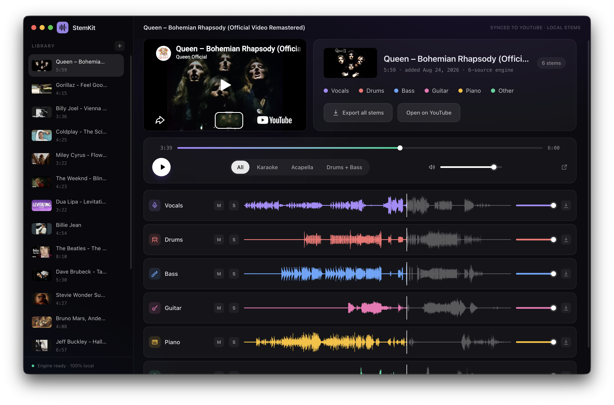

# StemKit

> [!NOTE]
> **Credits & Acknowledgement**: StemKit was created and designed by **[Daniel Ravina](https://github.com/danielravina)** in the original [danielravina/stemkit](https://github.com/danielravina/stemkit) repository. All credit for the foundational architecture and concept belongs to him! This fork contains personal enhancements and community improvements built on top of his work (such as SOTA BS-RoFormer stem separation, continuous background playback with a mini player, audio-focused playback that ditches YouTube video streaming once fetched, and UI polish).

Split any YouTube song into isolated stems — **vocals, drums, bass, guitar, piano** and more — right on your machine.

Search YouTube or paste a link, pick the instruments you want, and play the result like a multitrack DAW: every stem on its own fader, all perfectly in sync. Karaoke, acapellas and instrumentals are one click away. Once a track is fetched, YouTube is ditched entirely for pure, lightweight local audio playback.

Everything runs locally — no accounts, no cloud, no API keys.

 

<p align="center">
  
</p>

## Features

- Built-in YouTube search, or paste a link
- Choose your instruments individually; the right separation engine is picked for you
- Pure local audio playback — once fetched, no YouTube video streaming or overhead
- Persistent mini player for seamless listening while browsing or fetching new tracks
- One-click presets: **All · Karaoke · Acapella · Drums + Bass**
- Per-stem mute/solo/volume, waveforms with click-to-seek
- **Guitar & bass tablature** transcribed from the isolated stems, synced to the song: scrolling tab with beat-accurate bars, chord names, hammer-on / pull-off / slide marks, live fretboard, text tab, MIDI export
- **Import a MIDI file** (Guitar Pro / DAW export, or one you downloaded) and get a fingered tab for it — the reliable path when you already have the notes
- **Practice tools**: A-B loop (click a bar number to loop it), slow-down speed, play the tab with a synth in sync, or render it into a mixer lane and play along with the original muted
- Synchronized karaoke lyrics with an editor
- Parallel background splitting with live progress
- Export any stem (or all) as WAV
- Fully offline after setup — separation runs on Apple Silicon (MPS), NVIDIA GPUs (CUDA) or CPU; ffmpeg included

## Download

Grab installers from [Releases](https://github.com/danvelope/stemkit/releases):
- **macOS** (Apple Silicon): `StemKit-x.y.z-mac-arm64.dmg`
- **Windows**: `StemKit-Setup-x.y.z.exe` (installer) or portable `.zip`

First launch creates a private Python environment and downloads the separation engine (~2 GB) — one time. ffmpeg is bundled — nothing else to install.

Optional quality upgrades live behind a gear icon in the app (Settings), each with its own one-time download:
- **Studio-quality vocals** (Mel-Band Roformer): +913 MB — runs on GPU or CPU (CPU is slower)
- **Fine-tuned demucs** (htdemucs_ft): +~320 MB, up to 4× slower
- **Refinement passes**: 2 shifts instead of 1, up to 3× slower

The tablature engine installs itself the first time you open a tab stage (~150 MB: Basic Pitch on ONNX Runtime, CREPE, librosa).

> **macOS first launch**: builds are signed with a Developer ID but not notarized, so macOS may say it "cannot verify the developer". One-time fix: **System Settings → Privacy & Security → Open Anyway** (or `xattr -cr /Applications/StemKit.app`).
>
> **Windows**: SmartScreen may warn on first run — "More info → Run anyway".

## Requirements

- **macOS 12+** (Apple Silicon) or **Windows 10/11** (x64)
- No manual installs: if no Python 3.9+ is detected, StemKit downloads a private runtime (python-build-standalone) during first-launch setup
- Node.js 20+ only for building from source

## Develop

```bash
npm install
npm run dev
```

Wrong Node version? Scripts auto-relaunch with a suitable one (nvm / nvm-windows).

## Build & release

```bash
bash scripts/fetch-ffmpeg.sh        # mac (one time)
powershell scripts/fetch-ffmpeg.ps1 # windows (one time)

npm run dist        # mac dmg -> release/
npm run dist:win    # windows nsis+zip -> release/
npm run dist:all    # both (on the matching OS)
```

Releases are built by GitHub Actions:
- push a tag `v*` → binaries attach to a draft GitHub Release
- `workflow_dispatch` ("Run workflow") → on-demand artifacts on the run page

macOS builds are Developer-ID-signed when the certificate is available — see **Signing in CI** below for the one-time setup, plus optional notarization.

### Signing in CI (one-time setup)

Local builds sign with your keychain cert automatically. CI runners have empty keychains, so hand them the certificate via repo **secrets**:

1. Keychain Access → My Certificates → right-click `Developer ID Application: ...` → Export → `.p12` (set an export password)
2. Base64 it and add these repo secrets:
   - `CSC_MAC_P12` — the base64 string: `base64 -i developer-id.p12 | pbcopy`
   - `CSC_MAC_PASSWORD` — the export password from step 1
3. Optional (full notarization, zero Gatekeeper prompts): add `APPLE_ID`, `APPLE_APP_SPECIFIC_PASSWORD`, `APPLE_TEAM_ID` **and** set repo variable `ENABLE_NOTARIZATION` to `true` (Settings → Secrets and variables → Actions → Variables). Requires an **active** Apple Developer membership — Apple's notary service rejects expired accounts.

Without these secrets CI falls back to ad-hoc signing (app runs, but Gatekeeper complains on download).

## How it works

```
YouTube URL ──► yt-dlp (+JS runtime) ──► bundled ffmpeg ──► BS-RoFormer / Demucs FT ──► stems/*.wav
                                        │                                                 │
Electron renderer ◄──── IPC events ─────┘                     tab_transcribe.py ◄─────────┘
Local Web Audio API stem playback · per-stem volume / solo / mute faders · synth lanes
```

### Tablature engine

`python/tab_transcribe.py` turns a stem (or a MIDI file) into a tab:

| Stage | What runs |
|---|---|
| Beat grid | `librosa` beat tracking on the **full mix** (drums make it robust), downbeat voted from chord changes + accents; bars follow the tracked beats instead of a single fixed BPM, so they never drift. Nudge the bar start from the footer if it lands a beat off. |
| Bass | pYIN f0 tracking (long analysis frames built for the low register) + onset detection + legato segmentation; octave errors repaired against the harmonic series in a CQT. |
| Guitar · notes & riffs | Spotify **Basic Pitch** (ONNX Runtime, works on every platform) anchored to a CREPE pitch contour to repair octave errors, then a harmonic ghost-note filter. |
| Guitar · single-note lead | CREPE (tiny on CPU/MPS, full on CUDA) with pYIN fallback, same segmentation as bass. |
| Guitar · chords & strums | Beat-synchronous chroma → Viterbi chord decoding (maj, min, 7, maj7, m7, sus2, sus4, 5) → open / barre / power voicings placed on the strum onsets actually in the audio. |
| Fingering | Viterbi over (string, fret) candidates: playable spans, hand-position inertia scaled by the time available to move, open-string and low-position preferences. |
| MIDI import | Any `.mid` track → octave-fitted to the instrument → same fingering solver; bars come from the file's tempo map. |

Set `STEMKIT_F0_TRACKER=pyin` or `STEMKIT_CREPE_MODEL=full` in the environment to override the tracker choices.

## Notes

- Downloading audio from YouTube violates their ToS for public products — keep this personal.
- yt-dlp breaks occasionally when YouTube changes things; the error dialog offers a one-click update (updates `yt-dlp` + the challenge solver together).

## Layout

```
src/main         Electron main process (pipeline, env bootstrap, library)
src/preload      IPC bridge
src/renderer     React UI (player, waveforms, mini player, audio engine)
python/          separate.py (BS-RoFormer / demucs), transcribe.py (lyrics), tab_transcribe.py (tabs) — JSON progress output
python/tests/    synthetic ground-truth check for the tab engine
python/vendor/   vendor model code
scripts/         node runner, ffmpeg fetchers
build/           icon sources
```

## Credits

Massive gratitude to **[Daniel Ravina](https://github.com/danielravina)**, creator of the original [StemKit](https://github.com/danielravina/stemkit). If you enjoy this project, make sure to check out and star the [original upstream repository](https://github.com/danielravina/stemkit)!

